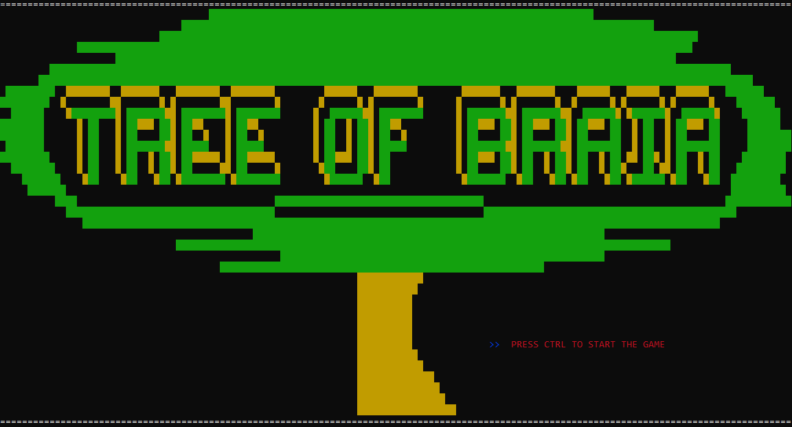
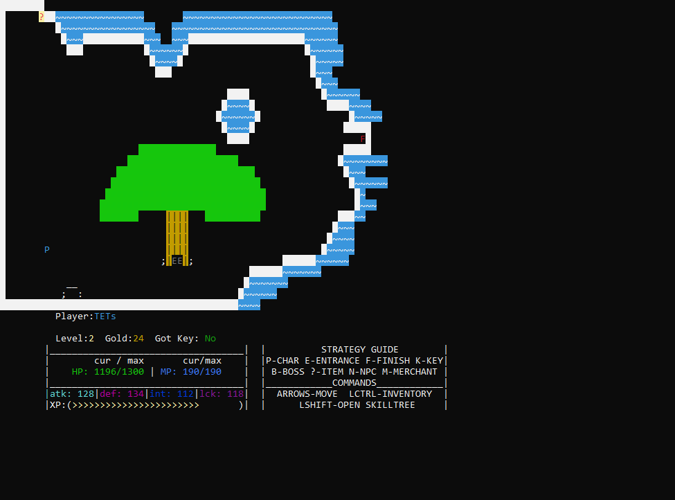

# Data-Structures-2---Tree-of-Braia
Archive of the final project for the Data Structures 2 Course at UFCAT.

## Description
Tree of Braia was conceived as a small ASCII-Art RPG project that encompasses most of Data Structures 2's content,such as: 

* Binary Trees (fastest ones to implement, but Red-Black Trees were considered in the early stages)
* Abstract Data Types (to hold enemy, player, inventory and map data in an organized way)
* Hash Tables (used very sparingly in this project)

But those alone are't what makes the game, it also uses some special files and headers to have colors in the console and manipulate the window, allow the player to move and interact with things, etc:

* `atari.h` (a small library coded internally to make it easier to change the console's colors per char type, so each char has a certain color to it)
* `conio2.h` (Is the one that implements the color range we can use in the console)
* `windows.h` (Allows us to manipulate the console window, and use keyboard keys for actions instead of just typing)
* Externally loads Windows Media Player in order to play select .ogg files as BGM.

As such, this project is windows-only by nature, requiring a significant rewrite to work on linux.

## Features

The game has some gameplay features to take note of:

* Player leveling system with some grindiing being required in some areas, or item abuse as some older RPGs also do.

* Inventory system to hold items, but can only be used outside of random encounters, so be warned.

* Skill Tree to unlock new skills as the player levels up.

* Multiple maps with different themes each, some even having interiors to explore. (Second image below)

* A hub world where the player can interact with NPCs, buy items with gold, and restore HP/MP.

* Gameplay loop that revolves around finding a key in each map to progress, with some boss fights in-between.

* Random encounters with enemies as the player moves through the world (Third image below).

* Enemy weakness and strength system, sometimes forcing the player to figure out an enemy's weakness to progress.

* A small Strategy Guide always present to remind the player of the controls, and meaning of objects in the screen.

